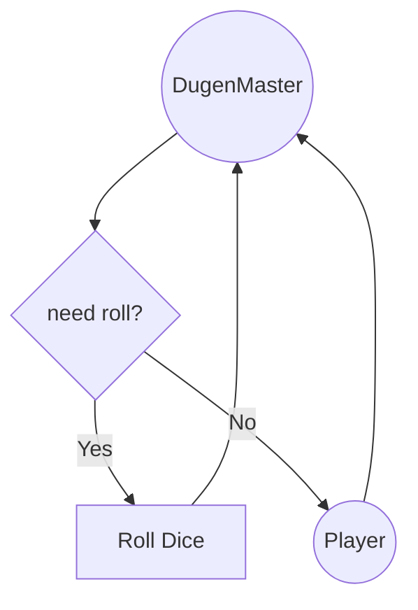

# Agents with Tool

This tutorial demonstrated how to create a simple TRPG agent using LangChain and LangGraph. The agent simulates a DM and a Player, facilitating a fast-play DnD game. You can extend this code to add more complex interactions, additional game mechanics, or integrate with other tools and APIs for a richer gaming experience.


### Core Explanation

* We use AgentBase as Agents for different role
* We use Conditional Edge to use Tool



#### Base Class for Agent

Create an abstract base class for tasks.

```python
class AgentBase(ABC):
    def __init__(self, state: TRPGState):
        self.state = state

    @abstractmethod
    def get_prompt_template(self) -> str:
        pass

    def execute(self) -> TRPGState:
        self.state["history"] = clip_history(self.state["history"])
        template = self.get_prompt_template()
        prompt = PromptTemplate.from_template(template)
        llm_chain = prompt | llm | StrOutputParser()
        generation = llm_chain.invoke({"history": self.state["history"], "roll_number": self.state["roll_number"]})
        data = json.loads(generation)
        self.state["need_roll"] = data.get("need_roll", "")        
        self.state["roll_number"] = -1
        self.state["history"] += "\n" + generation
        self.state["history"] = clip_history(self.state["history"])
        return self.state
```

#### Roles

Define agents for DM and Player.

```python
class DM(AgentBase):
    def get_prompt_template(self) -> str:
        return """
            {history}
            As DnD DM, describe the current scenario for the player. (in short, we do fast play)
            sometimes roll dice, sometimes not.            
            player roll {roll_number}, if > 0 you need explain what the roll affect result, start from your roll {roll_number} blablabla
            Output the JSON in the format: {{"scenario": "your action description", "need_roll": True/False}}
        """

class Player(AgentBase):
    def get_prompt_template(self) -> str:
        return """
            Here is the scenario: {history}
            As a Player, I want to perform an action. (in short, we do fast play)
            Output the JSON in the format: {{"action": "I want xxxx"}}
        """
```

#### Tool

A function to simulate rolling a 20-sided dice.

```python
def RollDice(state: TRPGState) -> TRPGState:
    random_number = random.randint(1, 20)
    state["history"] += "\n" +  "roll result:" + str(random_number)
    state["history"] = clip_history(state["history"])
    state["need_roll"] = False
    state["roll_number"] = random_number
    return state
```

#### Conditional Edge to use Tool Function

for conditional edge

```python
def check_need_roll(state: TRPGState) -> Literal["roll", "not roll"]:
    if state.get("need_roll") == True:
        return "roll"
    else:
        return "not roll"
```


```python
workflow.add_conditional_edges(
    "dm",
    check_need_roll,
    {
        "not roll": "player",
        "roll": "RollDice"
    }
)
```
