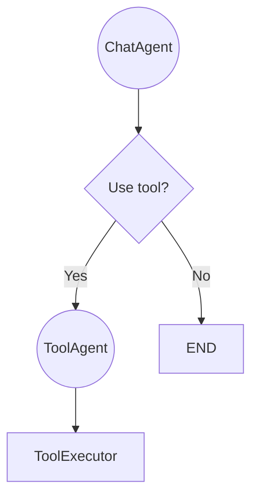

# Agents Choose Tool

In this tutorial, tools are functions that can be dynamically used within the state machine. Tools are defined using the `@tool` decorator, which also registers them with the system, making them available for use by agents within the workflow.

Further, we have an agent to decide whether to use a tool or not and let the tool_agent give commands to execute the chosen tool. 



## Core Explanation

### Defining and Registering Tools

To define a tool, simply create a function and decorate it with the `@tool` decorator. Ensure that you include detailed parameter descriptions in the docstring for clarity.

Here's an example:

```python
from typing import List

@tool
def add(a: int, b: int) -> int:
    """
    :function: add
    :param int a: First number to add
    :param int b: Second number to add
    :return: Sum of a and b
    """
    return a + b


@tool
def filewrite(name: str, content: str) -> None:
    """
    :function: filewrite
    :param str name: Name of the file
    :param str content: Content to write to the file
    :return: None
    """

    #
    # implementation
    #

    print(f"Writing to {name}: {content}")

```
