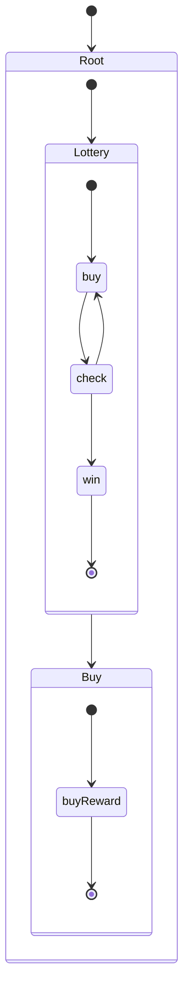

# LangGraph Subgraphs: Nested Structure

## Overview

This example demonstrates a nested subgraph approach in LangGraph, where the main workflow is structured as a hierarchy of subgraphs. This approach promotes modularity and reusability by encapsulating specific functionalities into distinct subgraphs.

The overall architecture can be visualized as follows:



Key Concepts:

*   **Everything is a Subgraph:** The main flow is a *root* subgraph, and all other logic is contained within subgraphs. This helps maintain separation of concerns.
*   **Subgraph Registry:** A central `subgraph_registry` stores all compiled subgraphs, allowing for dynamic retrieval.
*   **Root Subgraph Orchestrates:** The root subgraph manages the overall flow of the application by calling other subgraphs.

## Code Structure

### 1. Subgraph Registry

```python
subgraph_registry: Dict[str, Any] = {}
```

This dictionary acts as a central hub for storing all compiled subgraphs, making them easily accessible by name.

### 2. Individual Subgraphs

Each subgraph defines a specific part of the overall workflow (e.g., `lottery`, `buy`). They have their own state definition and workflow logic. These can be seen in the diagram above.

### 3. Subgraph Usage

An orchestrator by invoking different subgraphs according to the application logic.

with a node:
```
root_builder.add_node("lottery", route_to_lottery)
```

to invoke:

```python
def route_to_lottery(state: RootState):
    subgraph = subgraph_registry["lottery"]

    # Pass the try_times from RootState into LotteryState
    lottery_state = {"input": "0", "winnings": None, "missed": None, "try_times": state.get('try_times', 0)}
    response = subgraph.invoke(lottery_state)
    
```
This is how we trigger a subgraph, in this case, `lottery`, and pass relevant state values.

## Usage Pattern

1.  **Invoke the Subgraph:** The main workflow invokes the subgraph as the first step.
2.  **Subgraph Orchestrates:** The subgraph, in turn, invokes other subgraphs as required, passing the necessary data.
3.  **Data Passing:** Note that data is passed from parent subgraph to child subgraph by using subgraph.invoke(start_state_for_child_graph)

This pattern facilitates better organization and management of complex workflows. Each part of the application is encapsulated within its subgraph, making it easier to test and maintain.
